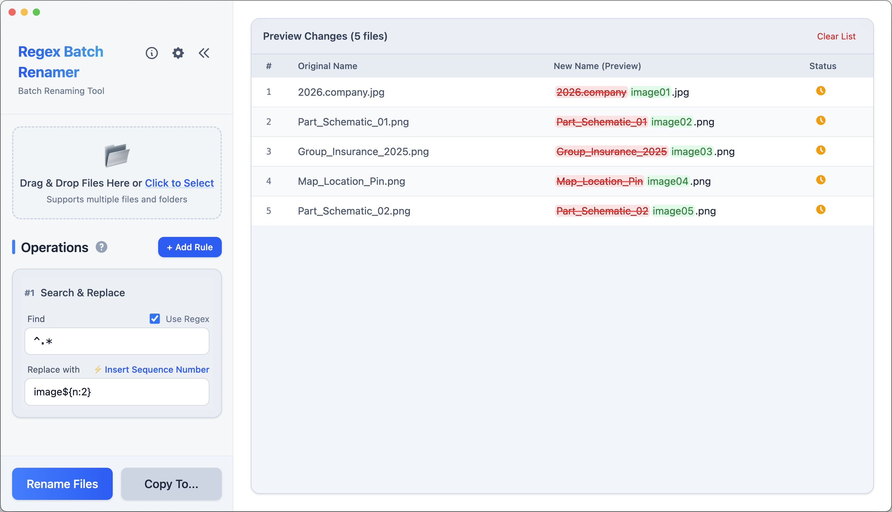

# Regex Batch Renamer

[繁體中文](README.zh-TW.md) | [简体中文](README.zh-CN.md) | **English**

🌐 **Official Website**: https://renamer.junyou.tw/


A powerful and intuitive cross-platform batch file renaming tool (Windows / macOS / Linux). Supports Regular Expressions (Regex), plain text replacement, and sequential numbering, making tedious file renaming tasks easy and simple.

<br clear="left"/>
<br />



## ✨ Key Features

- **Intuitive Operation**: Supports Drag & Drop and real-time preview of renaming results.
- **Dual Modes**:
    - **Regex Mode**: Supports full Regular Expression syntax, suitable for advanced users.
    - **Plain Text Mode**: Automatically handles escape characters, intuitively replacing special symbols like `[]`, `()`.
- **Sequential Numbering**: Easily insert incrementing numbers using `${n}` syntax, with support for zero-padding (e.g., `${n:03}`).
- **Modern Interface**: Designed with a premium look and feel, fully supporting macOS Light/Dark modes (follows system settings).
- **Safe & Reliable**: Full preview before execution, and supports "Copy To..." to preserve original files.

## 📥 Installation

### macOS Users Note

Unsigned macOS builds may still trigger Gatekeeper warnings depending on how the app was downloaded and unpacked. If your system blocks the app because of quarantine metadata, you can clear it manually:

```bash
xattr -r -d com.apple.quarantine /Applications/Regex\ Batch\ Renamer.app
```

### Windows / Linux

Simply download and run the installer for your platform.

## 🚀 Quick Start

1. **Add Files**: Drag files to the top-left area or click the button to select files.
2. **Add Rule**: Click "+ Add Rule" in the "Operations" section on the left.
3. **Set Conditions**:
    - Enter content for "Find" and "Replace with".
    - Check/Uncheck "Use Regex" to switch modes.
4. **Preview Results**: The list on the right will show a real-time preview of the renamed files, with changes highlighted.
5. **Execute**: Once confirmed, click "Rename Files" to modify directly, or "Copy To..." to copy renamed files to a new location.

## 📖 Advanced Tutorial

### Sequential Numbering (${n})

Use `${n}` in the "Replace with" field to insert sequence numbers:

- `${n}`: 1, 2, 3...
- `${n:03}`: 001, 002, 003...

### Common Regex Examples

- **Remove Whitespace**: Find `\s+`, Replace with `(Empty)`
- **Standardize Date**: Find `(\d{4})(\d{2})(\d{2})`, Replace with `$1-$2-$3` (Converts 20231125 to 2023-11-25)

_For more tutorials, click the "?" button in the software interface._

## 🛠️ Technologies Used

This project is built using modern web technologies:

- **Desktop Runtime**: [Tauri](https://tauri.app/) for the stable desktop application, with the previous [Electron](https://www.electronjs.org/) line retained temporarily during retirement
- **Frontend**: [Vue 3](https://vuejs.org/) (Composition API)
- **Language**: [TypeScript](https://www.typescriptlang.org/)
- **Styling**: [Tailwind CSS](https://tailwindcss.com/)
- **Build Tool**: [Vite](https://vitejs.dev/)
- **State Management**: [Pinia](https://pinia.vuejs.org/)

## 🧪 Release Channels

The stable desktop release line now runs on Tauri in `main`.

The beta channel remains available with a separate delivery path:

- `main` + `v*` tags: stable Tauri releases
- `beta` branch pushes: Tauri beta validation CI only
- `beta-v*` tags: Tauri GitHub draft pre-releases for manual review

Useful commands:

```bash
pnpm run tauri:dev
pnpm run tauri:build
pnpm run electron:dev
pnpm run electron:build
```

If `TAURI_UPDATER_PUBKEY` and a channel-specific updater endpoint are provided, `pnpm run tauri:build:release` generates a release config with updater metadata. Without those values, the build still completes, but app-integrated updating is not enabled.

Stable releases are published directly. Beta releases are created as draft prereleases so the maintainer can review assets before publishing them. The Tauri app checks for updates on launch and prefers in-app installation whenever the updater endpoint serves valid metadata for the active channel.

### Stable In-App Update Verification

For a real stable updater test, verify with two consecutive stable versions:

1. Install the older stable app, for example `v0.5.0`.
2. Publish the next stable tag, for example `v0.5.1`.
3. Confirm the new release includes updater artifacts such as `.sig`, `.app.tar.gz`, `.AppImage.sig`, or Windows updater signatures.
4. On macOS, move the installed app into `/Applications` before testing the in-app install flow.
5. Open the older installed app and wait for the startup update check.
6. Confirm the update banner or About dialog reports the newer stable version.
7. Run the in-app install flow, relaunch the app, and confirm the runtime version changed to the new stable version.
8. After the relaunch, the About dialog changelog view should show GitHub release history directly and automatically focus the version that was just installed; each version card should also link to its GitHub release page.

The stable updater endpoint is intended to point at the repository-backed manifest:

```text
https://raw.githubusercontent.com/junyou1998/regex-batch-renamer/main/updater/stable.json
```

The planned Electron removal gates and deletion order are documented in [docs/electron-retirement-plan.md](docs/electron-retirement-plan.md).

## ☕ Support Development

If you find this tool helpful, consider buying me a coffee to support continued development!

<a href="https://www.buymeacoffee.com/junyou" target="_blank"></a>

## 📄 License

MIT License
