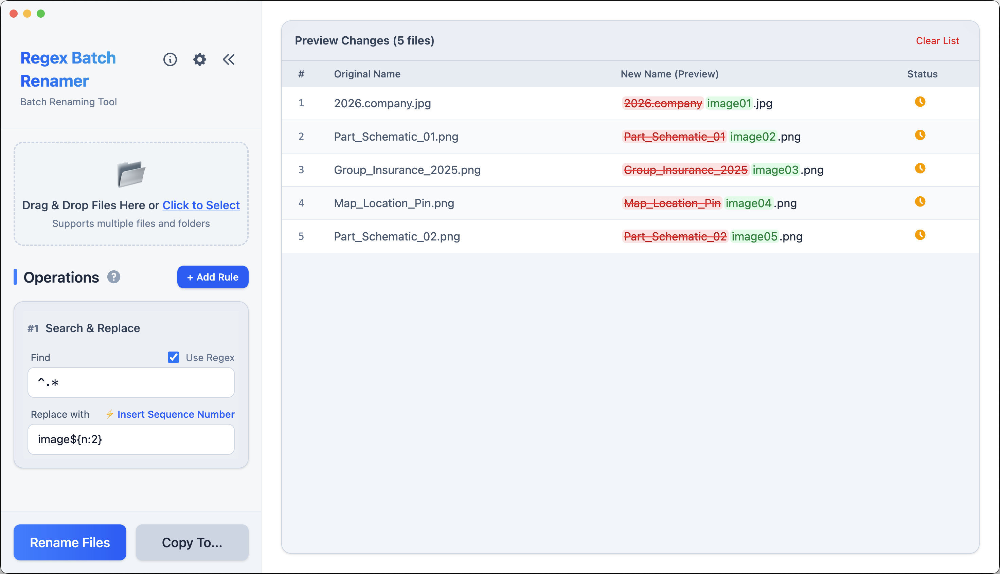

# Regex Batch Renamer

[繁體中文](README.zh-TW.md) | **简体中文** | [English](README.md)

🌐 **官方网站**: https://renamer.junyou.tw/


一个强大、极致轻量且直观的跨平台批量重命名工具 (支持 macOS / Windows / Linux)。基于 **Tauri v2 + Vue 3 + Tailwind CSS v4 + Rust** 打造，支持正则表达式 (Regex)、纯文本替换、自定义快速模板与流水号功能，让繁琐的文件重命名工作变得流畅且简单。

<br clear="left"/>
<br />



## ✨ 主要功能

- **🤖 AI 智能规则助理**：
    - **自然语言生成规则**：用自然语言描述重命名意图（例如「将日期前移、删除括号前缀、转下划线小写」），由 AI 自动分析文件特征并生成精准的 Regex 规则管道。
    - **本地 CLI 模式**：支持 **Claude Code CLI**、**OpenAI Codex CLI** 与 **xAI Grok CLI**，直接使用本地已登录的 CLI 工具进行生成。
    - **主流 API 与本地 Ollama**：支持 **Google Gemini**、**OpenAI**、**Anthropic** 云端 API，以及 **Ollama 本地离线模型**（免密钥、自动匹配本地模型标签）。
    - **双层配置管理与安全中断**：支持自定义多组 AI 配置与一键切换默认，生成中途随时可即时「停止生成」并释放连接／终止进程。
- **直观操作**：支持拖拽文件 (Drag & Drop) 与即时高亮预览重命名结果。
- **双重重命名模式**：
    - **Regex 模式**：支持完整强大的正则表达式语法，适合进阶批量处理。
    - **纯文本模式**：自动处理转义字符，直观替换 `[]`、`()`、空格等特殊符号。
- **灵活流水号**：使用 `$n` 或 `${n}` 语法轻松插入递增数字，支持自定义起始值与位数补零（如 `${n:2}` 或 `001`）。
- **快速与自定义模板**：内置常用模板（如移除空格、转下划线、全局序号替换），并支持将常用重命名流程保存为自定义模板随时调用。
- **安全保护机制**：
    - 执行前完整预览冲突检测。
    - 支持「创建副本」保留原始文件。
    - **窗口关闭保护**：有未应用的重命名时主动弹出确认，防止误关遗失进度。
- **质感现代化界面**：沉浸式原生 Titlebar 设计，支持侧边栏折叠收起与 macOS / Windows / Linux 深浅色主题（自动跟随系统）。

## 📥 下载与安装

请至 [GitHub Releases](https://github.com/junyou1998/regex-batch-renamer/releases) 下载最新安装包：

- **macOS**：提供 Apple Silicon (`.dmg`) 与 Intel 安装包。
- **Windows**：提供 64 位安装程序 (`.exe`)。
- **Linux**：提供 AppImage 与 `.deb` 软件包。

### macOS 用户注意事项

若安装未签名的 macOS 版本触发 Gatekeeper 提示，可在终端执行指令手动解除隔离：

```bash
xattr -r -d com.apple.quarantine "/Applications/Regex Batch Renamer.app"
```

## 🚀 快速开始

1. **加入文件**：将文件拖拽至窗口任意区域，或点击「加入文件 / 加入文件夹」。
2. **新增规则**：在左侧「重命名流程」中点击「+ 新增规则」或选择「⚡ 快速模板」。
3. **设定条件**：
    - 输入「查找目标」与「替换为」内容。
    - 勾选/取消勾选「使用正则表达式 (Regex)」切换模式。
4. **预览结果**：右侧表格即时预览新文件名，变更部分以绿色高亮标记。
5. **执行更名**：确认无误后，点击「执行重命名」直接修改文件名，或「创建副本」另存文件。

## 📖 常用技巧

### 流水号 ($n)

在「替换为」字段中使用序号变量：
- `${n}`：1, 2, 3...
- `${n:2}` 或 `${n:03}`：01, 02, 03... / 001, 002, 003...

### 常用 Regex 范例

- **删除空白**：查找 `\s+`，替换为 `(留空)`
- **日期格式标准化**：查找 `(\d{4})(\d{2})(\d{2})`，替换为 `$1-$2-$3` (将 20231125 转为 2023-11-25)
- **删除括号与内容**：查找 `\s*\([^)]*\)`，替换为 `(留空)`

## 🤖 AI 智能规则助理使用指南

1. **开启助理**：点击右上角「✨ AI 助理」按钮展开对话侧栏。
2. **选择或新增服务**：
   - 默认提供 **Claude Code CLI**、**OpenAI Codex CLI** 与 **xAI Grok CLI** 本地模式（需本地已安装并登录）。
   - 或点击「设置 > AI 助理」新增 **Google Gemini**、**OpenAI**、**Anthropic** 或 **本地 Ollama** API 配置。
3. **自然语言提问**：
   - 「帮我把文件名中的日期 20240101 改成 2024-01-01」
   - 「移除动漫压制组的 [XXX] 前缀并补上 S01E 流水号」
   - 「提取所有下划线前的文字，其余转为大写」
4. **即时应用**：AI 会在对话中回传分析结果与重命名规则管道，并支持「自动应用」或手动一键载入至左侧重命名流程！

## 🛠️ 开发与技术栈

本项目全面采用现代化技术架构打造：

- **桌面应用框架**：[Tauri v2](https://v2.tauri.app/) (高效、极致轻量的 Rust 后端)
- **前端框架**：[Vue 3](https://vuejs.org/) (Composition API + `<script setup>`)
- **样式引擎**：[Tailwind CSS v4](https://tailwindcss.com/)
- **编程语言**：[TypeScript](https://www.typescriptlang.org/) + [Rust](https://www.rust-lang.org/)
- **构建工具**：[Vite](https://vitejs.dev/)
- **状态管理**：[Pinia](https://pinia.vuejs.org/)
- **国际化支持**：[Vue I18n](https://vue-i18n.intlify.dev/)

### 本地开发指令

```bash
# 安装依赖 (优先使用 pnpm)
pnpm install

# 启动桌面应用开发模式 (含 Vite 热重载与 Rust 后端)
pnpm run dev

# 执行类型检查与前端构建验证
pnpm run tauri:ci

# 打包正式发行版桌面应用
pnpm run build
```

## ☕ 赞助开发

如果您觉得这个工具对您有帮助，欢迎赞助我一杯咖啡，这将成为我持续开发与维护的动力！

<a href="https://www.buymeacoffee.com/junyou" target="_blank"></a>

## 📄 授权

[MIT License](LICENSE)
